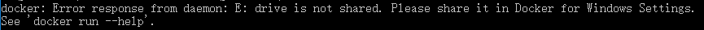
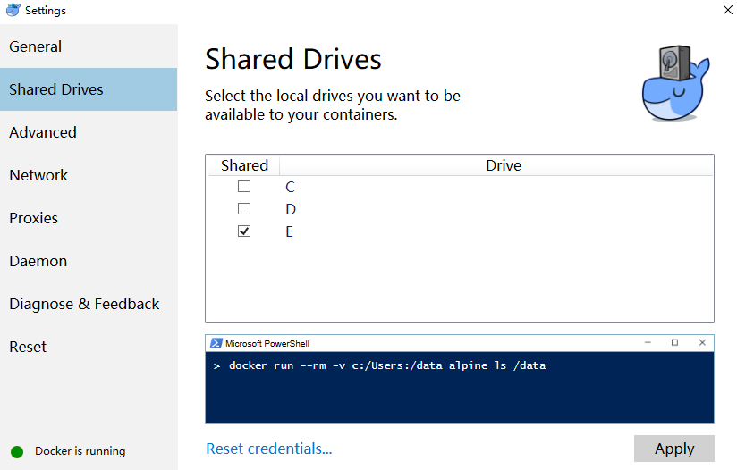
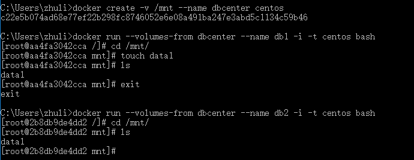

#Docker：存储

###存储
```
// 查看镜像或容器的底层信息
docker inspect centos
```
```
docker run -i -t --name test1 centos bash
echo 'hello www.baidu.com' > hello.txt
cat hello.txt	// 会输出文件里面的内容
exit
```
```
docker run -i -t --name test2 centos bash
cat hello.txt	// 会提示 cat: hello.txt: No such file or directory
```

`虽然test1还有test2都是基于centos这个镜像创建的，不过它们都拥有一个各自的可以读写的一个文件层，新创建的文件或者被修改的已有的文件都会被放到这个文件层里面，不会影响到镜像本身或者其它的使用这个镜像创建的容器`

```
docker rm test1 test2
```

`删除容器的时候，这些在容器层上面的文件也会被删除掉，如果有一些数据想要一直保存的话，比如说：web服务器里面的日志，数据库管理系统里面的数据，我们可以去为容器创建一个数据盘，然后把这些要常期保存的数据放到这些数据盘上面`

###指定主机目录作为数据盘
```
docker run -v E:\practise\data:/mnt -i -t --name=db centos bash
cd /mnt
touch data1
exit
docker rm db
切换到E:\practise\data目录下，存在data1这个文件
```
在创建容器的时候如果报如下错误：


解决方法：


###数据容器
我们可以去创建一个数据容器，也就是在创建这个容器的时候去给它指定一个数据盘，然后让其它的容器可以去使用这个数据容器来作为它们的数据盘
```
docker create -v /mnt --name dbcenter centos
docker run --volumes-from dbcenter --name db1 -i -t centos bash
cd /mnt
touch data1
ls
exit
docker run --volumes-from dbcenter --name db2 -i -t centos bash
cd /mnt
ls
```

