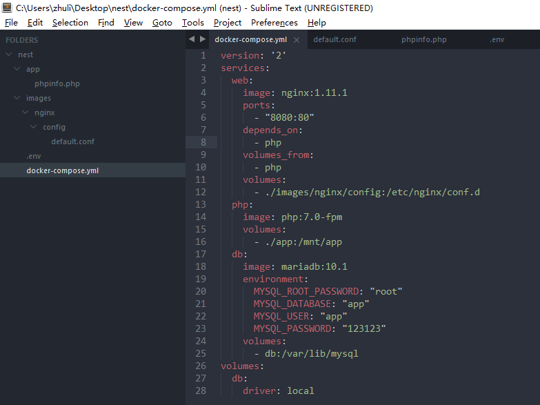
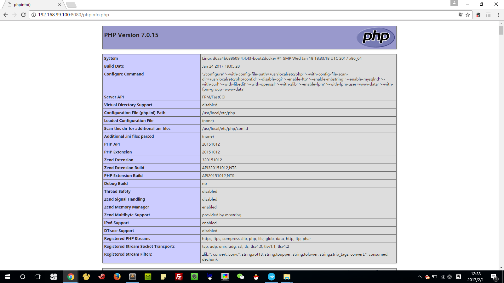

#Docker：容器化应用

###定义数据库服务
```
version: '2'
services:
  db:
    image: mariadb:10.1
    environment:
      MYSQL_ROOT_PASSWORD: "root"
      MYSQL_DATABASE: "app"
      MYSQL_USER: "app"
      MYSQL_PASSWORD: "123123"
    volumes:
      - db:/var/lib/mysql
volumes:
  db:
    driver: local
```

###测试数据库服务
```
docker-compose up -d
docker-compose exec db bash
mysql -u root -p
show databases;
create database test default charset utf8;
show databases;
exit
exit
docker-compose down
docker-compose up -d
docker-compose exec db bash
mysql -u root -p
show databases;
```

###定义PHP服务
```
version: '2'
services:
  php:
    image: php:7.0-fpm
    volumes:
      - ./app:/mnt/app
  db:
    image: mariadb:10.1
    environment:
      MYSQL_ROOT_PASSWORD: "root"
      MYSQL_DATABASE: "app"
      MYSQL_USER: "app"
      MYSQL_PASSWORD: "123123"
    volumes:
      - db:/var/lib/mysql
volumes:
  db:
    driver: local
```

./app/phpinfo.php
```
<?php phpinfo(); ?>
```

###定义nginx服务
```
version: '2'
services:
  web:
    image: nginx:1.11.1
    ports:
      - "8080:80"
    depends_on:
      - php
    volumes_from:
      - php
    volumes:
      - ./images/nginx/config:/etc/nginx/conf.d
  php:
    image: php:7.0-fpm
    volumes:
      - ./app:/mnt/app
  db:
    image: mariadb:10.1
    environment:
      MYSQL_ROOT_PASSWORD: "root"
      MYSQL_DATABASE: "app"
      MYSQL_USER: "app"
      MYSQL_PASSWORD: "123123"
    volumes:
      - db:/var/lib/mysql
volumes:
  db:
    driver: local
```

./images/nginx/config/default.conf
```
server {
	listen				80;
	server_name			localhost;
	root				/mnt/app;
	index				index.php index.html index.htm;

	location / {
		index			index.php index.html index.htm;
		try_files		$uri $uri/ /index.php?$query_string;
	}

	location ~ \.php$ {
		fastcgi_pass	php:9000;
		fastcgi_index	index.php;
		fastcgi_param	SCRIPT_FILENAME		$document_root$fastcgi_script_name;
		include			fastcgi_params;
	}
}
```

./.env
```
COMPOSE_CONVERT_WINDOWS_PATHS=1
```


测试
```
docker-compose up -d
```

通过浏览器访问：http://192.168.99.100:8080/phpinfo.php


###创建自己的服务
现在我们在compose文件里面定义的服务用的都是现成的镜像，有时候我们需要去定制一下这些镜像。比如说去添加一下自己的配置，去安装新的模块等等。比如我想去修改一下PHP服务里面的一些配置，现在你可以看到它的 upload_max_filesize 它的值是2M
```
version: '2'
services:
  web:
    image: nginx:1.11.1
    ports:
      - "8080:80"
    depends_on:
      - php
    volumes_from:
      - php
    volumes:
      - ./images/nginx/config:/etc/nginx/conf.d
  php:
    build:
      context: ./images/php
      dockerfile: Dockerfile
    volumes:
      - ./app:/mnt/app
  db:
    image: mariadb:10.1
    environment:
      MYSQL_ROOT_PASSWORD: "root"
      MYSQL_DATABASE: "app"
      MYSQL_USER: "app"
      MYSQL_PASSWORD: "123123"
    volumes:
      - db:/var/lib/mysql
volumes:
  db:
    driver: local
```

./images/php/Dockerfile
```
FROM php:7.0-fpm
MAINTAINER zhulinjie <zhulinjie_cool@126.com>

COPY ./config/php.ini /usr/local/etc/php/conf.d
```

./images/php/config/php.ini
```
// 创建服务需要的镜像
docker-compose build
// 重新创建需要的服务
docker-compose up -d
```
