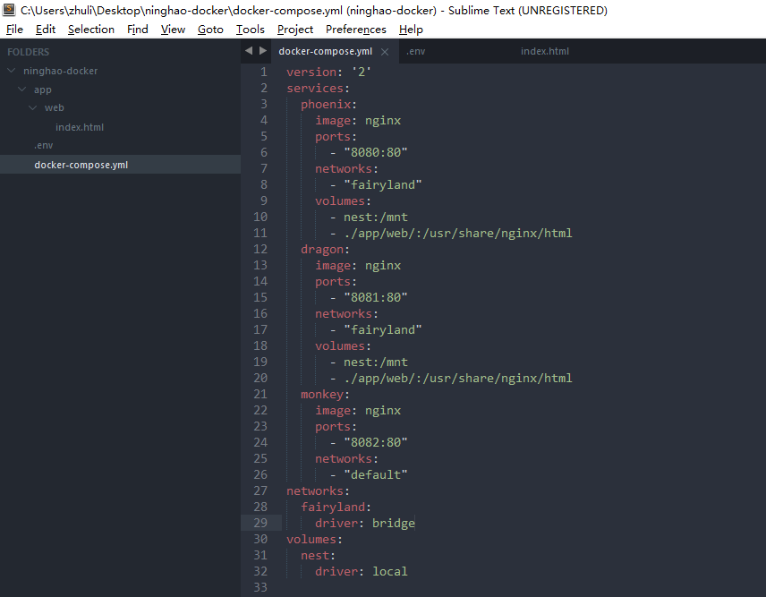
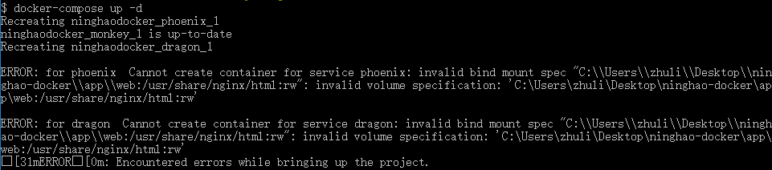

#Docker：组合

###定义服务
vi docker-compose.yml
```
version: '2'
services:
  phoenix:
    image: nginx
    ports:
      - "8080:80"
  dragon:
    image: nginx
    ports:
      - "8081:80"
```

###启动服务
```
// 启动服务
docker-compose up
// 通过浏览器访问 http://192.168.99.100:8080/		http://192.168.99.100:8081/
// 回到终端，这里会显示容器里面的一些日志，每条日志的前面会标注一下这个日志来自哪一个服务容器，ctrl+c可以停止它们，这些服务我们可以让它在后台去运行
docker-compose up -d
// 查看一下正在运行的容器
docker ps
```

###服务的生命周期
```
// 查看应用的服务
docker-compose ps
// 停止phoenix服务
docker-compose stop phoenix
// 停止所有在docker-compose.yml文件中定义的服务
docker-compose stop
// 重新启动phoenix服务
docker-compose start phoenix
// 启动所有服务
docker-compose start	
// 查看服务的日志
docker-compose logs
// 持续跟踪服务日志的变化
docker-compose logs -f
// 登录到phoenix服务容器中
docker-compose exec phoenix bash
// 要删除应用的服务需要先把它们都停止掉
docker-compose stop
// 删除所有服务的容器
docker-compose rm
// 注意rm不会删除掉创建的网络还有数据卷
docker network ls
// 这里的ninghaodocker_default就是我们的应用创建一个网络
// 如果想要删除所有的这些东西的话，可以使用
docker-compose down
docker network ls
```

###网络
网络决定了服务之间还有外界跟服务之间怎么样去进行沟通，在执行docker-compose up的时候，docker会给我们创建一个默认的网络，所有的服务也会属于这个默认的网络，服务跟服务之间可以使用服务的名字进行相互的通信，我们也可以创建自己的网络，然后让指定的服务加入到我们自己创建的这些网络里面，那么这样的话属于这个网络的服务之间可以进行通信，网络以外的服务就不能够去它们进行通信了， 这样的话会对这个服务有一个隔离的作用，让应用更安全一些
```
docker-compose up -d
docker-compose exec phoenix bash
ping dragon
exit
docker-compose exec dragon bash
ping phoenix
```

###定义网络
```
version: '2'
services:
  phoenix:
    image: nginx
    ports:
      - "8080:80"
    networks:
      - "fairyland"
  dragon:
    image: nginx
    ports:
      - "8081:80"
    networks:
      - "fairyland"
  monkey:
    image: nginx
    ports:
      - "8082:80"
    networks:
      - "default"
networks:
  fairyland:
    driver: bridge
```
```
// 重新启动服务
docker-compose up -d
docker-compose exec phoenix bash
ping dragon
ping monkey
// dragon能ping通，monkey不能ping通
```

###命名的数据卷
```
version: '2'
services:
  phoenix:
    image: nginx
    ports:
      - "8080:80"
    networks:
      - "fairyland"
    volumes:
      - nest:/mnt
  dragon:
    image: nginx
    ports:
      - "8081:80"
    networks:
      - "fairyland"
    volumes:
      - nest:/mnt
  monkey:
    image: nginx
    ports:
      - "8082:80"
    networks:
      - "default"
networks:
  fairyland:
    driver: bridge
volumes:
  nest:
    driver: local
```
```
docker-compose up -d
docker-compose exec phoenix bash
cd /mnt
touch phoenix_data_1
ls
exit
docker-compose exec dragon bash
cd /mnt
ls
```

###指定位置的数据卷（报了一个错，待解决）
docker-compose.yml
```
version: '2'
services:
  phoenix:
    image: nginx
    ports:
      - "8080:80"
    networks:
      - "fairyland"
    volumes:
      - nest:/mnt
      - ./app/web/:/usr/share/nginx/html
  dragon:
    image: nginx
    ports:
      - "8081:80"
    networks:
      - "fairyland"
    volumes:
      - nest:/mnt
      - ./app/web/:/usr/share/nginx/html
  monkey:
    image: nginx
    ports:
      - "8082:80"
    networks:
      - "default"
networks:
  fairyland:
    driver: bridge
volumes:
  nest:
    driver: local
```



```
docker-compose up -d
```

```
// 如果报了上面的错误，需要再新建一个.env文件
COMPOSE_CONVERT_WINDOWS_PATHS=1
```