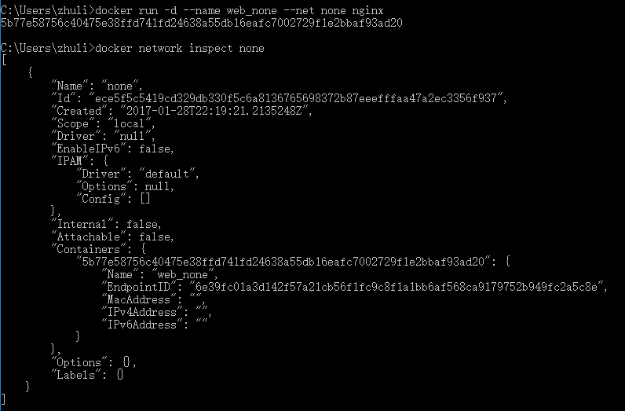

#Docker：网络

###网络
```
// 查看已有的网络
docker network ls
// 查看bridge网络的底层信息
docker network inspect bridge
// 创建一个后台运行的容器web1 --net用来指定要使用的网络，如果不加会默认使用bridge网络
// 如果本机没有nginx镜像，系统会自动从网络上下载
docker run -d --name web1 --net bridge nginx
// 再次查看bridge网络的底层信息
docker network inspect bridge
// 再创建一个容器web2
docker run -d --name web2 --net bridge nginx
// 再次查看bridge网络的底层信息，可以查看到已经有两个容器使用bridge网络了，在这个网络下面的容器之间可以相互通信
docker network inspect bridge
// 登录到web1
docker exec -it web1 bash
ping 172.17.0.3
// 可以ping通，说明web1和web2之间可以相互通信
```

###理解none网络
```
// 创建一个容器并指定none网络
docker run -d --name web_none --net none nginx
// 查看none网络的底层信息，可以看到web_none容器在使用none网络，但是并没有一个可以使用的ip地址，也就是说这个容器跟外界是一个完全隔离的状态，谁也没有办法和它通信
docker network inspect none
```


###理解host网络
```
// 创建一个容器并指定host网络
docker run -d --name web_host --net host nginx
// 查看host网络的底层信息，可以看到web_host容器在使用host网络，但是也没有一个可以使用的ip地址，因为使用host网络的容器的ip地址跟主机的网络是一样的
docker network inspect host
```

###端口
```
// 如果想让外界可以访问到咱默认的birdge网络上的容器提供的服务，需要告诉docker要使用哪一些端口

// 在创建容器的时候，我们可以去指定一下主机跟容器之间的一个端口的映射关系 
// 80（主机的80端口）:80（容器的80端口） 如果有人访问主机上面的80端口的时候，这个访问会被定向到这个容器上面的80端口
```
